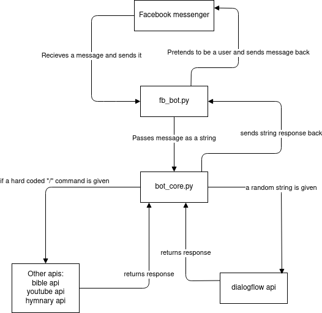

# Facebook bot

This a facebook messenger bot using the python module fbchat as a wrapper and dialogflow to generate the response messages

## How to use:

1) Go on googles dialogflow, make an account and create a new agent

2) As you are making the agent it should give you a private key which it tells you to store securely. This key is needed by the bot every time it wants to communicate to dialog flow for a response message. Save this key and name it "private_key.json" and put it in the src folder of the project. The python program will search for this file to find the key everytime the bot runs. IMPORTANT, without a private_key.json file in there, the bot wont run

3) Go into [data.py](http://data.py) and replace all the relevant info with your info

4) Run the bot by running fb_bot.py with "python3 fb_bot.py"

5) If there are any missing modules, make sure to download them. There is a requirments.txt included though I didnt make a virtual environment so some of the modules might not actually be used unfortunately.

 

## How it works

Fbchat is a python module that pretends to be an actual user logged in to a browser by sending http requests to facebook. When the bot is running, it actively "Listens" for events to happen such as getting a message which then facebook will send back to fbchat as JSON data which we can then extract the message and analyse it.

Below is how all the files in the project work together

# Caution!!

Please use this bot on throwaway accounts as there is a risk of the facebook account being banned. Also, due to the limit of requests that certain api's allow, such as youtube's api and bible api, please make an account on their websites and get your own api key to prevent the api key from reaching its request limit
